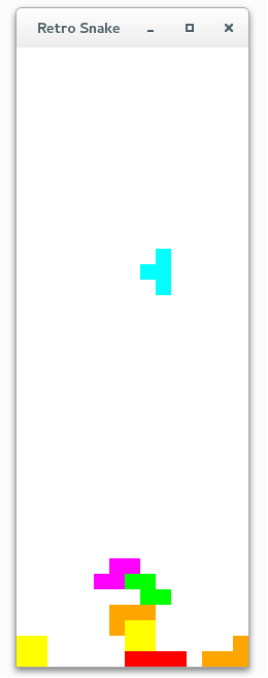

# AlphaTetris
> Tetrix Game with Artificial Intelligence(AI)



## Features
+ Reinforcement learning

## Dependencies
+ Python 3+
+ PyQt5
+ h5py
+ Keras, tensorflow(Recommend), Theano(Optional)
+ matplotlib
+ numpy
+ scikit

## Status
Working on it...

## How to play
+ In the terminal (Linux)  
    ```python alphatetris/tetris.py```

## Extra
It's not game for human, but for the computers. It's an competence among different type of artificial intelligences, which contain human expert system, deep search, Monte Carlo sampling, evolutionary algorithm, linear regression, support vector machine, recommend system, neural network, deep learning. Which will be the last winner? Let's explore the answers!